# Logic-Principles

- 由truth table得到逻辑表达式

1相加(SOP)，0相乘(POS)

### Boolean Algebra Theorems

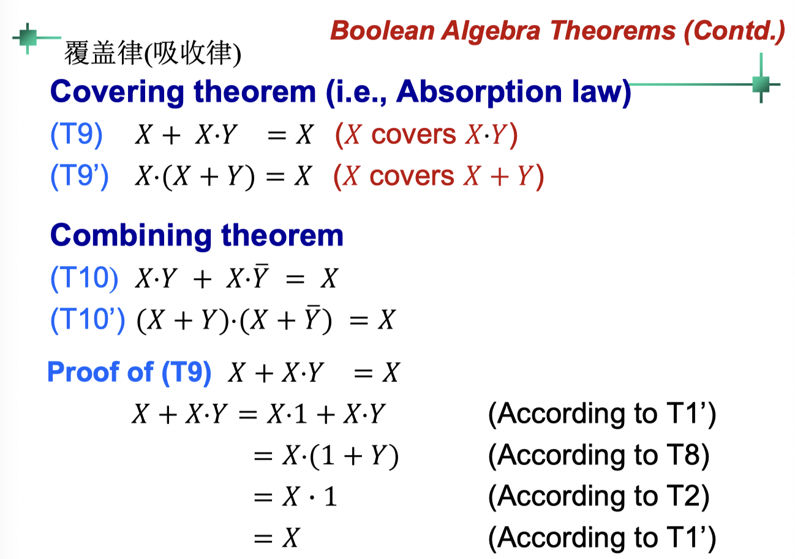

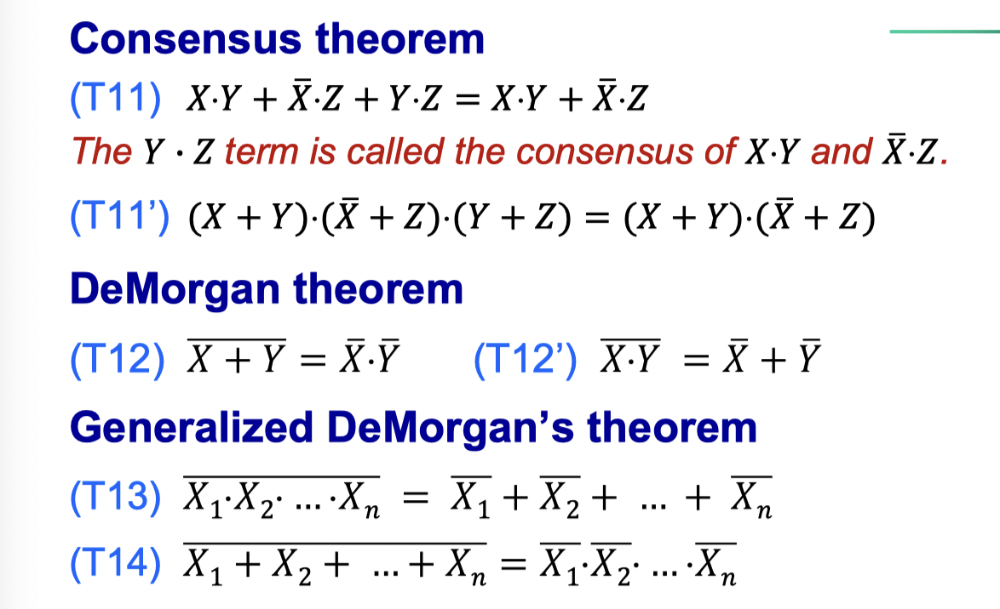

- $X + \bar{X} Y = X + Y$

- Duality 对偶特性

The dual of a logic expression is obtained by swapping 0 and 1, and • and +. (variables do not change)

## K-map

binary sequence of  abc follows **Gray code**

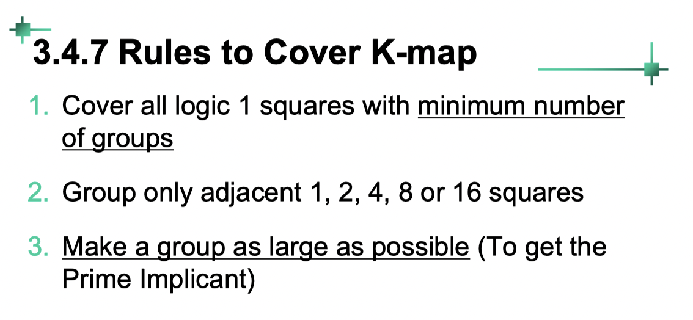

- Each implicant is a **product** term of the function

- implicants (蕴含项)

  - **Prime Implicants**: a group that covers the maximum possible number of adjacent squares.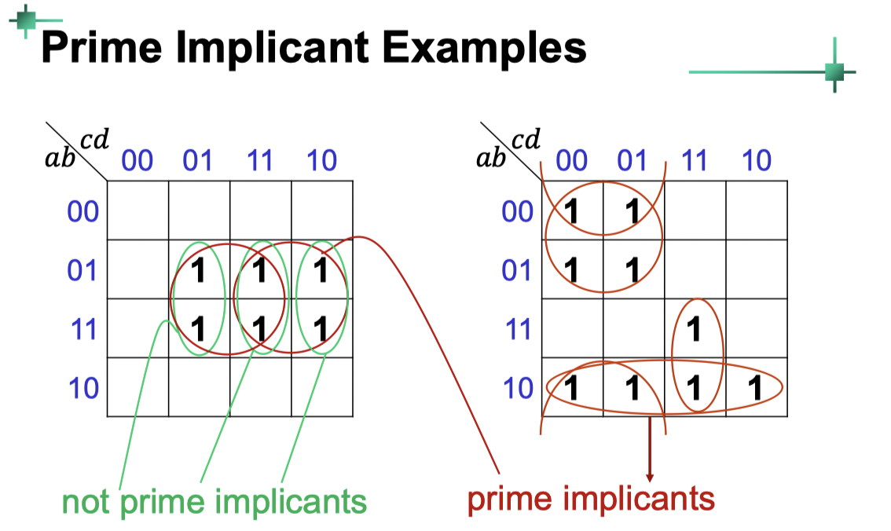

  - **Essential Prime Implicants**: a prime implicant that ==covers a minterm== which is not covered by any other prime implicants

### Minimized Logic Fucntions

#### K-map for Sums of Product

**All** essential prime implicants + other **needed** prime implicants

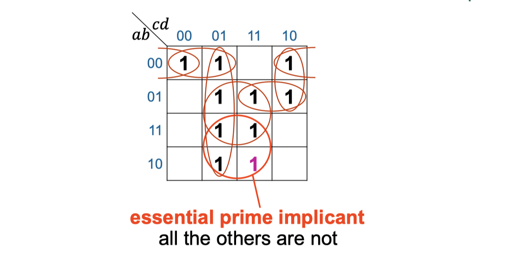

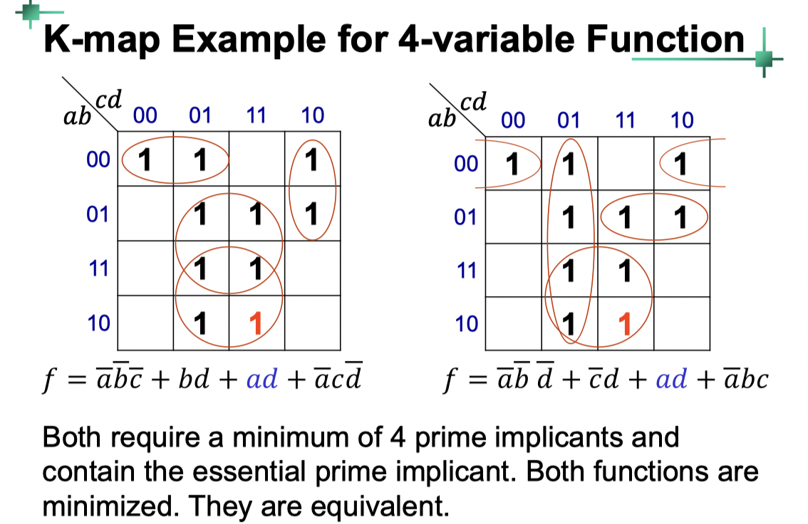

#### K-map for Product of Sums

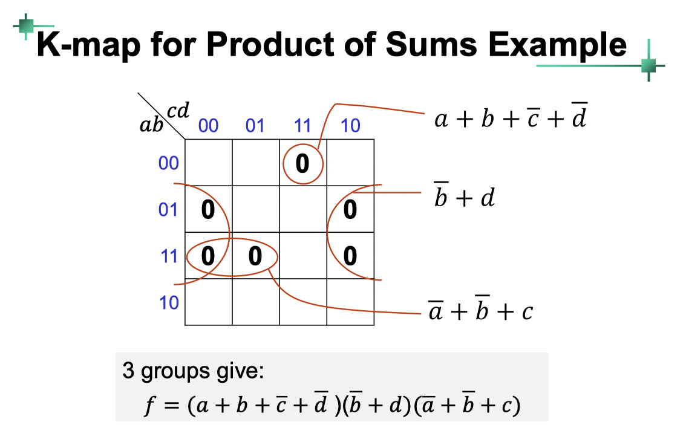

#### K-map for XOR and XNOR

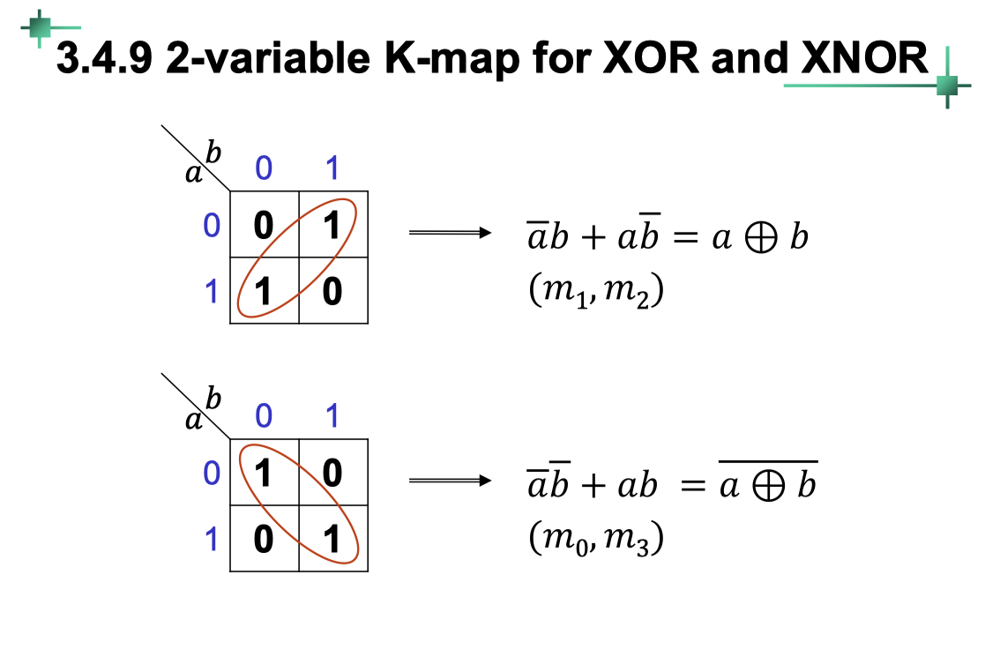

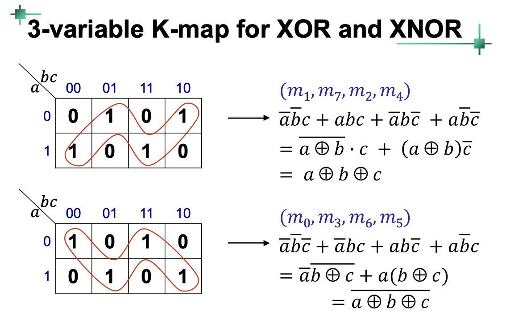

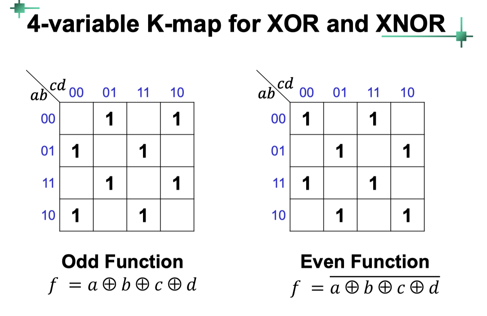

#### Odd and Even Functions

- In general, for an n-variable Odd Function, the function is 1 if there are odd number of variables having logic 1

​	e.g. **XOR**

- For an n-variable Even Function, the function is 1 if there are even number of variables having logic 1

​	e.g. **XNOR**

#### DON'T-CARE Conditions

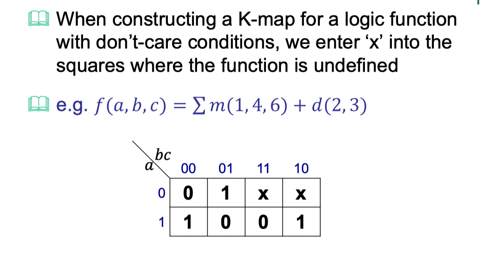

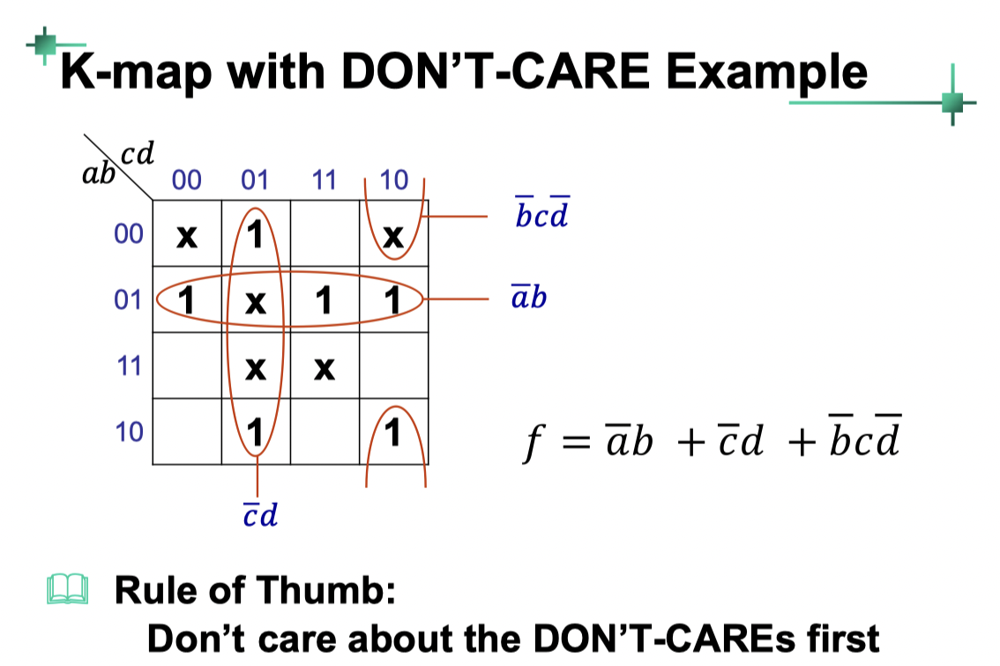

#### 5-variable K-map

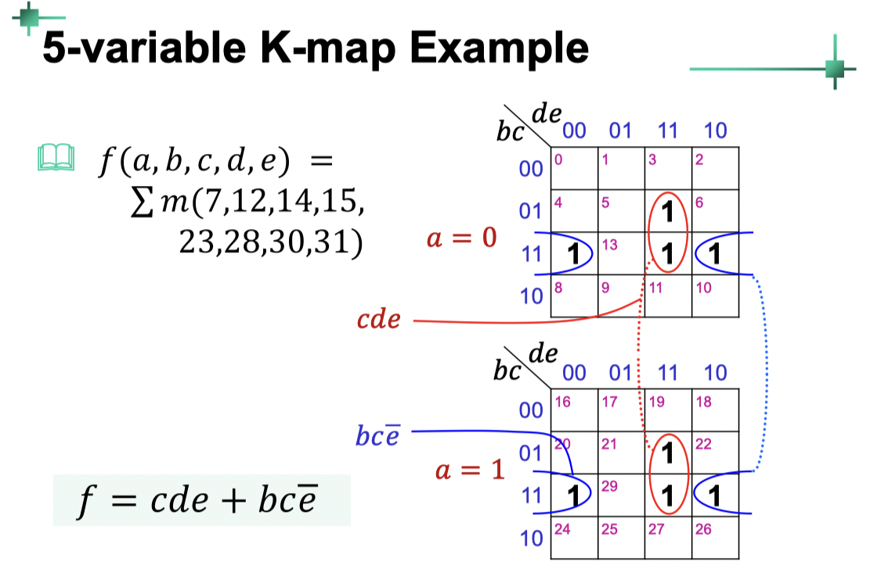

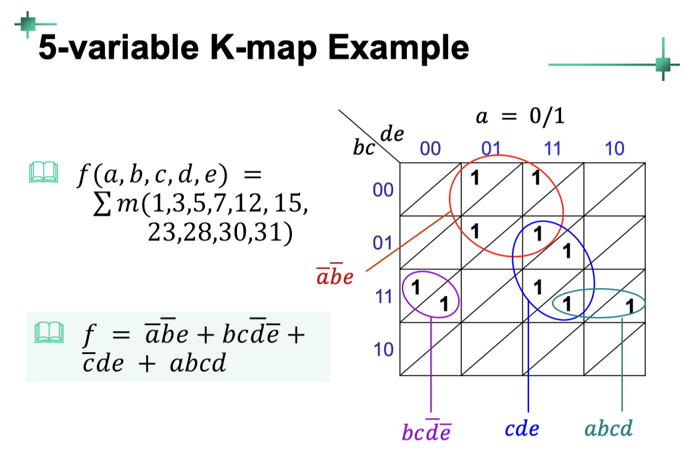

[Back to Outline](outline.md)

 
