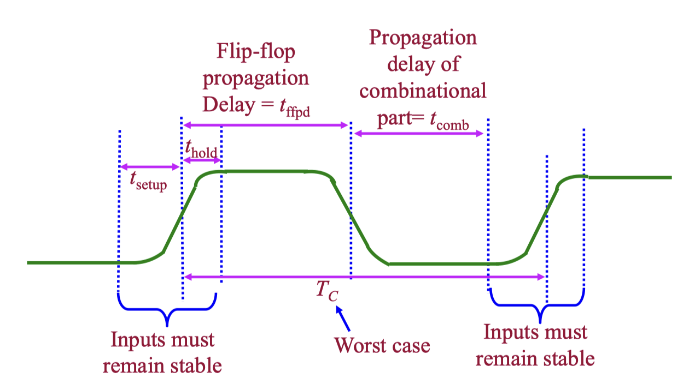
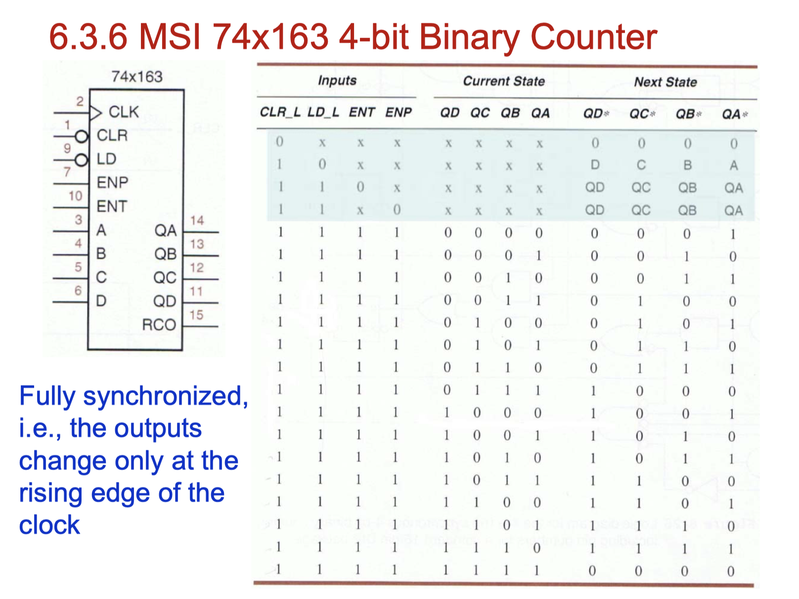
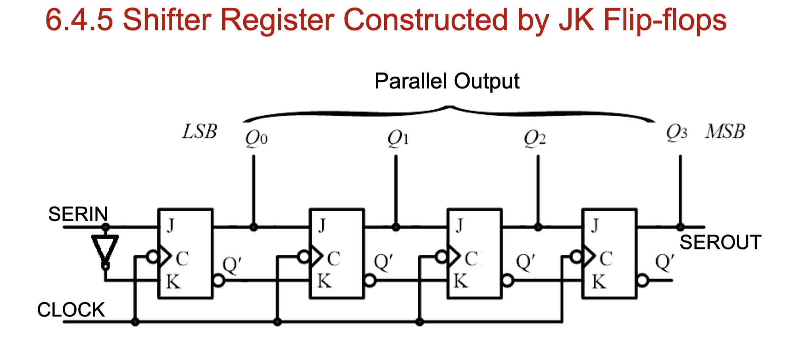
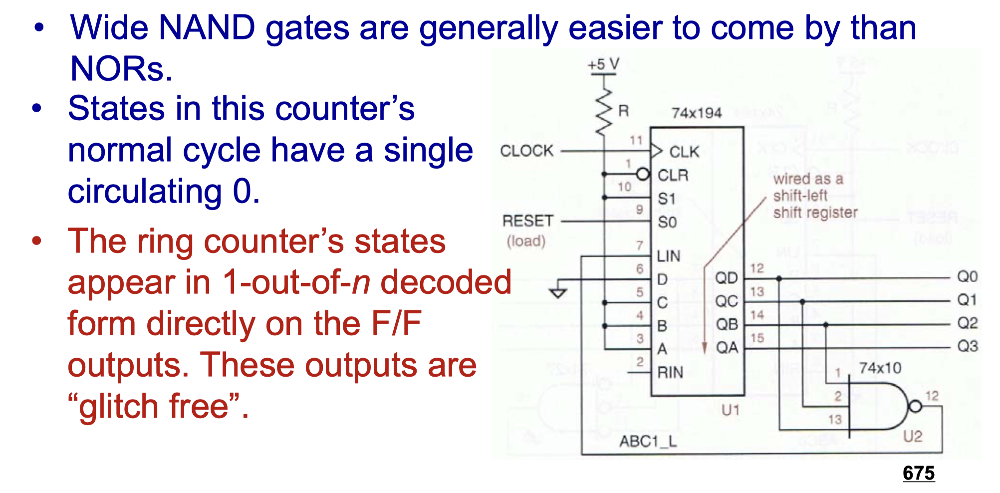

# CLASS 6 Sequential Logic

[toc]

### Maximum Clock Frequency

$\displaystyle T_{Cmin} = t_{setup} + t_{ffpd(max)} + t_{comb(max)}$

$\displaystyle f_c = \frac{1}{T_c} \le \frac{1}{t_{setup} + t_{ffpd(max)} + t_{comb(max)}}$

#### Setup and Hold-time Violation

- Setup-time margin > 0

  $t_{clk} - t_{ffpd}(max) - t_{comb}(max) - t_{setup}$ 

  (ffpd: flip-flop propagation delay)

- Hold-time margin > 0

  $t_{ffpd}(min) + t_{comb}(min) - t_{hold}$

### Multibit Registers and Latches

### Constructing Counters

- Given Modulo-N counters, construct a Modulo-M counter

  - N > M

    1. Asynchronous reset: State S~M~ -> S~0~ (immediately)
    2. Synchronous reset: State S~M-1~ -> S~0~

  - N < M

    multiple modulo-N counters

### Shift Register

#### Self-correcting (Ring) Counter

[Back to Outline](outline.md)
